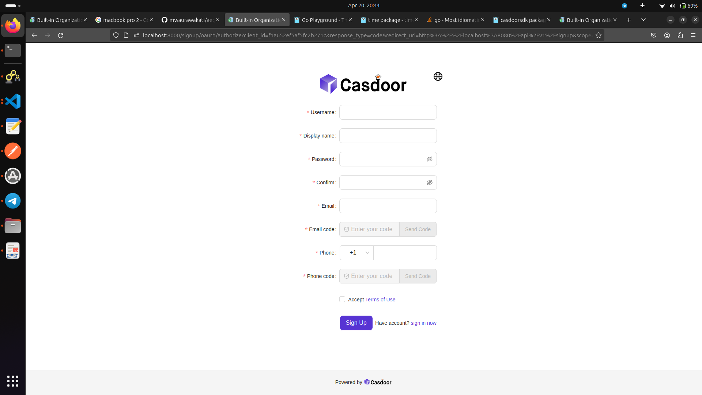
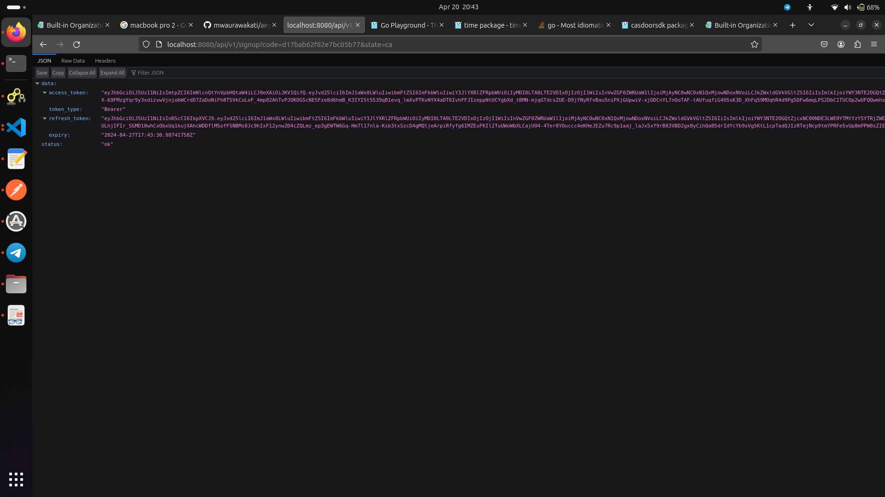

# Certificate Authority

This project has casdoor and certificates both running as indipendent images. Each service uses an indipendent mysql dabasase instance

## How does the API work, the logic between different files?

1. README - Documentation
2. main.go - The entry point to the certificate authority
3. go.mod - packages controller
4. conf.go - has helper function that loads the casdoor config
5. app.yaml - casdoor config
6. rest-api/controllers/controllers.go - It has the golang Gin handler functions for the API
7. models/models.go - It has SOME of the models used in the API
8. logs/log.go - handles logging
9. db/db.go and db/cert.go handles db operations
10. db.yaml - db config
11. CA - The files in this folder handles the certificates operations

## Do you need casdoor? Can it be replaced?

The reason Cadoor was included was to give control that existing images might not offer. If you find it wise to replace it, you are free to do so.

## How handlers work and headers.

This project does not set any headers. Except for content type and Authorization header that are set on the client side not from the server side. For more information on how the handlers work, see Golang Gin documenation.

## How is the token and Authentication managed?

See casdoor documentation.

## App.yaml

When the application client ID changes, you must rebuild it. Another option is to set env variables which is beyond the scope of this order.
Localhost is not hardended. I can behave the way you want it to. Currenty its configured to be in the same docker compose as casdoor. That is why it seems hardcoded. It must always be able to find the casdoor hostname. With a little adjustment, it can be set to anything.

## Authentication

The project uses casdoor for authentication. The endpoints for signin and signup are


| Method | Endpoint       | Exaplnation            |
| ------ | -------------- | ---------------------- |
| ANY    | /api/v1/signup | signup through casdoor |
| ANY    | /api/v1/signin | signin through casdoor |

These two endpoints are not authenticated. They redirect you to casdoor where you can signin or sign up. These two endpoints gives an authentication token after successful signin.

Go to the browser and paste the endpoint link which will redirect you to casdoor login



Fill in the details and you will be redirected back to the endpoint where you will get the auth token



## User endpoints

These enpoints must be authenticated through authorization header


| Method | Endpoint                         | Exaplnation                                                   |
| ------ | -------------------------------- | ------------------------------------------------------------- |
| GET    | /api/v1/users/{name}             | get user by username                                          |
| GET    | /api/v1/users/me/get             | Get user who is making the request. The authenticated user    |
| DELETE | /api/v1/users/me                 | Delete user who is making the request. The authenticated user |
| PATCH  | /api/v1/users/me                 | Edit the current Authenticated User                           |
| GET    | /api/v1/users/{name}/permissions | get user permisions by username                               |
| GET    | /api/v1/users/{name}/roles       | get user permisions by username                               |

# Enpoints list

## 1 /api/v1/signup

### Description

Signup endpoint

### Method

ANY

### Requirement:

None

### How it works.

Just paste the enpoint in browser. It will redirect you to casdoor signup page. After successful signup, you will get an access token

Editing user endpoint's payload is the [User](https://pkg.go.dev/github.com/casdoor/casdoor-go-sdk@v0.39.0/casdoorsdk#User) struct of the casdoorsdk package. Here is the payload:

```go
type User struct {
	Owner       string `xorm:"varchar(100) notnull pk" json:"owner"`
	Name        string `xorm:"varchar(100) notnull pk" json:"name"`
	CreatedTime string `xorm:"varchar(100) index" json:"createdTime"`
	UpdatedTime string `xorm:"varchar(100)" json:"updatedTime"`

	Id                string   `xorm:"varchar(100) index" json:"id"`
	Type              string   `xorm:"varchar(100)" json:"type"`
	Password          string   `xorm:"varchar(100)" json:"password"`
	PasswordSalt      string   `xorm:"varchar(100)" json:"passwordSalt"`
	PasswordType      string   `xorm:"varchar(100)" json:"passwordType"`
	DisplayName       string   `xorm:"varchar(100)" json:"displayName"`
	FirstName         string   `xorm:"varchar(100)" json:"firstName"`
	LastName          string   `xorm:"varchar(100)" json:"lastName"`
	Avatar            string   `xorm:"varchar(500)" json:"avatar"`
	AvatarType        string   `xorm:"varchar(100)" json:"avatarType"`
	PermanentAvatar   string   `xorm:"varchar(500)" json:"permanentAvatar"`
	Email             string   `xorm:"varchar(100) index" json:"email"`
	EmailVerified     bool     `json:"emailVerified"`
	Phone             string   `xorm:"varchar(20) index" json:"phone"`
	CountryCode       string   `xorm:"varchar(6)" json:"countryCode"`
	Region            string   `xorm:"varchar(100)" json:"region"`
	Location          string   `xorm:"varchar(100)" json:"location"`
	Address           []string `json:"address"`
	Affiliation       string   `xorm:"varchar(100)" json:"affiliation"`
	Title             string   `xorm:"varchar(100)" json:"title"`
	IdCardType        string   `xorm:"varchar(100)" json:"idCardType"`
	IdCard            string   `xorm:"varchar(100) index" json:"idCard"`
	Homepage          string   `xorm:"varchar(100)" json:"homepage"`
	Bio               string   `xorm:"varchar(100)" json:"bio"`
	Tag               string   `xorm:"varchar(100)" json:"tag"`
	Language          string   `xorm:"varchar(100)" json:"language"`
	Gender            string   `xorm:"varchar(100)" json:"gender"`
	Birthday          string   `xorm:"varchar(100)" json:"birthday"`
	Education         string   `xorm:"varchar(100)" json:"education"`
	Score             int      `json:"score"`
	Karma             int      `json:"karma"`
	Ranking           int      `json:"ranking"`
	IsDefaultAvatar   bool     `json:"isDefaultAvatar"`
	IsOnline          bool     `json:"isOnline"`
	IsAdmin           bool     `json:"isAdmin"`
	IsForbidden       bool     `json:"isForbidden"`
	IsDeleted         bool     `json:"isDeleted"`
	SignupApplication string   `xorm:"varchar(100)" json:"signupApplication"`
	Hash              string   `xorm:"varchar(100)" json:"hash"`
	PreHash           string   `xorm:"varchar(100)" json:"preHash"`
	AccessKey         string   `xorm:"varchar(100)" json:"accessKey"`
	AccessSecret      string   `xorm:"varchar(100)" json:"accessSecret"`

	CreatedIp      string `xorm:"varchar(100)" json:"createdIp"`
	LastSigninTime string `xorm:"varchar(100)" json:"lastSigninTime"`
	LastSigninIp   string `xorm:"varchar(100)" json:"lastSigninIp"`

	GitHub          string `xorm:"github varchar(100)" json:"github"`
	Google          string `xorm:"varchar(100)" json:"google"`
	QQ              string `xorm:"qq varchar(100)" json:"qq"`
	WeChat          string `xorm:"wechat varchar(100)" json:"wechat"`
	Facebook        string `xorm:"facebook varchar(100)" json:"facebook"`
	DingTalk        string `xorm:"dingtalk varchar(100)" json:"dingtalk"`
	Weibo           string `xorm:"weibo varchar(100)" json:"weibo"`
	Gitee           string `xorm:"gitee varchar(100)" json:"gitee"`
	LinkedIn        string `xorm:"linkedin varchar(100)" json:"linkedin"`
	Wecom           string `xorm:"wecom varchar(100)" json:"wecom"`
	Lark            string `xorm:"lark varchar(100)" json:"lark"`
	Gitlab          string `xorm:"gitlab varchar(100)" json:"gitlab"`
	Adfs            string `xorm:"adfs varchar(100)" json:"adfs"`
	Baidu           string `xorm:"baidu varchar(100)" json:"baidu"`
	Alipay          string `xorm:"alipay varchar(100)" json:"alipay"`
	Casdoor         string `xorm:"casdoor varchar(100)" json:"casdoor"`
	Infoflow        string `xorm:"infoflow varchar(100)" json:"infoflow"`
	Apple           string `xorm:"apple varchar(100)" json:"apple"`
	AzureAD         string `xorm:"azuread varchar(100)" json:"azuread"`
	Slack           string `xorm:"slack varchar(100)" json:"slack"`
	Steam           string `xorm:"steam varchar(100)" json:"steam"`
	Bilibili        string `xorm:"bilibili varchar(100)" json:"bilibili"`
	Okta            string `xorm:"okta varchar(100)" json:"okta"`
	Douyin          string `xorm:"douyin varchar(100)" json:"douyin"`
	Line            string `xorm:"line varchar(100)" json:"line"`
	Amazon          string `xorm:"amazon varchar(100)" json:"amazon"`
	Auth0           string `xorm:"auth0 varchar(100)" json:"auth0"`
	BattleNet       string `xorm:"battlenet varchar(100)" json:"battlenet"`
	Bitbucket       string `xorm:"bitbucket varchar(100)" json:"bitbucket"`
	Box             string `xorm:"box varchar(100)" json:"box"`
	CloudFoundry    string `xorm:"cloudfoundry varchar(100)" json:"cloudfoundry"`
	Dailymotion     string `xorm:"dailymotion varchar(100)" json:"dailymotion"`
	Deezer          string `xorm:"deezer varchar(100)" json:"deezer"`
	DigitalOcean    string `xorm:"digitalocean varchar(100)" json:"digitalocean"`
	Discord         string `xorm:"discord varchar(100)" json:"discord"`
	Dropbox         string `xorm:"dropbox varchar(100)" json:"dropbox"`
	EveOnline       string `xorm:"eveonline varchar(100)" json:"eveonline"`
	Fitbit          string `xorm:"fitbit varchar(100)" json:"fitbit"`
	Gitea           string `xorm:"gitea varchar(100)" json:"gitea"`
	Heroku          string `xorm:"heroku varchar(100)" json:"heroku"`
	InfluxCloud     string `xorm:"influxcloud varchar(100)" json:"influxcloud"`
	Instagram       string `xorm:"instagram varchar(100)" json:"instagram"`
	Intercom        string `xorm:"intercom varchar(100)" json:"intercom"`
	Kakao           string `xorm:"kakao varchar(100)" json:"kakao"`
	Lastfm          string `xorm:"lastfm varchar(100)" json:"lastfm"`
	Mailru          string `xorm:"mailru varchar(100)" json:"mailru"`
	Meetup          string `xorm:"meetup varchar(100)" json:"meetup"`
	MicrosoftOnline string `xorm:"microsoftonline varchar(100)" json:"microsoftonline"`
	Naver           string `xorm:"naver varchar(100)" json:"naver"`
	Nextcloud       string `xorm:"nextcloud varchar(100)" json:"nextcloud"`
	OneDrive        string `xorm:"onedrive varchar(100)" json:"onedrive"`
	Oura            string `xorm:"oura varchar(100)" json:"oura"`
	Patreon         string `xorm:"patreon varchar(100)" json:"patreon"`
	Paypal          string `xorm:"paypal varchar(100)" json:"paypal"`
	SalesForce      string `xorm:"salesforce varchar(100)" json:"salesforce"`
	Shopify         string `xorm:"shopify varchar(100)" json:"shopify"`
	Soundcloud      string `xorm:"soundcloud varchar(100)" json:"soundcloud"`
	Spotify         string `xorm:"spotify varchar(100)" json:"spotify"`
	Strava          string `xorm:"strava varchar(100)" json:"strava"`
	Stripe          string `xorm:"stripe varchar(100)" json:"stripe"`
	TikTok          string `xorm:"tiktok varchar(100)" json:"tiktok"`
	Tumblr          string `xorm:"tumblr varchar(100)" json:"tumblr"`
	Twitch          string `xorm:"twitch varchar(100)" json:"twitch"`
	Twitter         string `xorm:"twitter varchar(100)" json:"twitter"`
	Typetalk        string `xorm:"typetalk varchar(100)" json:"typetalk"`
	Uber            string `xorm:"uber varchar(100)" json:"uber"`
	VK              string `xorm:"vk varchar(100)" json:"vk"`
	Wepay           string `xorm:"wepay varchar(100)" json:"wepay"`
	Xero            string `xorm:"xero varchar(100)" json:"xero"`
	Yahoo           string `xorm:"yahoo varchar(100)" json:"yahoo"`
	Yammer          string `xorm:"yammer varchar(100)" json:"yammer"`
	Yandex          string `xorm:"yandex varchar(100)" json:"yandex"`
	Zoom            string `xorm:"zoom varchar(100)" json:"zoom"`
	MetaMask        string `xorm:"metamask varchar(100)" json:"metamask"`
	Web3Onboard     string `xorm:"web3onboard varchar(100)" json:"web3onboard"`
	Custom          string `xorm:"custom varchar(100)" json:"custom"`

	// WebauthnCredentials []webauthn.Credential `xorm:"webauthnCredentials blob" json:"webauthnCredentials"`
	PreferredMfaType string   `xorm:"varchar(100)" json:"preferredMfaType"`
	RecoveryCodes    []string `xorm:"varchar(1000)" json:"recoveryCodes"`
	TotpSecret       string   `xorm:"varchar(100)" json:"totpSecret"`
	MfaPhoneEnabled  bool     `json:"mfaPhoneEnabled"`
	MfaEmailEnabled  bool     `json:"mfaEmailEnabled"`

	Ldap       string            `xorm:"ldap varchar(100)" json:"ldap"`
	Properties map[string]string `json:"properties"`

	Roles       []*Role       `json:"roles"`
	Permissions []*Permission `json:"permissions"`
	Groups      []string      `xorm:"groups varchar(1000)" json:"groups"`

	LastSigninWrongTime string `xorm:"varchar(100)" json:"lastSigninWrongTime"`
	SigninWrongTimes    int    `json:"signinWrongTimes"`

	ManagedAccounts []ManagedAccount `xorm:"managedAccounts blob" json:"managedAccounts"`
}
```

# CERTIFICATES

## CREATING CERTIFICATES

These enpoints used for creating certificates


| Method | Endpoint                          | Exaplnation                 |
| ------ | --------------------------------- | --------------------------- |
| POST   | /api/certificates/generate/ca     | Create CA certificate       |
| POST   | /api/certificates/generate/client | Create a client certificate |
| POST   | /api/certificates/generate/server | Create a server certificate |
| POST   | /api/certificates/generate/ssl    | Create ssl certficate       |

ALl the certficates has the same payload. It should be application/json
The payload:

```go
type Payload struct {
	CommonName       string   `json:"common_name" example:"root-ca" binding:"required"`
	ParentCommonName string   `json:"parent_common_name" example:"root-ca"`
	Identity         Identity `json:"identity" binding:"required"`
}
```

Where Identity

```go

// A Identity represents the Certificate Authority Identity Information
type Identity struct {
	Organization       string   `json:"organization" example:"Company"`                         // Organization name
	OrganizationalUnit string   `json:"organization_unit" example:"Security Management"`        // Organizational Unit name
	Country            string   `json:"country" example:"NL"`                                   // Country (two letters)
	Locality           string   `json:"locality" example:"Noord-Brabant"`                       // Locality name
	Province           string   `json:"province" example:"Veldhoven"`                           // Province name
	EmailAddresses     string   `json:"email" example:"sec@company.com"`                        // Email Address
	DNSNames           []string `json:"dns_names" example:"ca.example.com,root-ca.example.com"` // DNS Names list
	IPAddresses        []net.IP `json:"ip_addresses,omitempty" example:"127.0.0.1,192.168.0.1"` // IP Address list
	Intermediate       bool     `json:"intermediate" example:"false"`                           // Intermendiate Certificate Authority (default is false)
	KeyBitSize         int      `json:"key_size" example:"2048"`                                // Key Bit Size (defaul: 2048)
	Valid              int      `json:"valid" example:"365"`                                    // Minimum 1 day, maximum 825 days -- Default: 397
	Algorithm          string   `json:"algorithm"`
	CertType           string   `json:"cert_type"`
}
```

* For ssl, client and server certficates, a query parameter ca_name must be present else will raise an error ca_name not provided. This design decision was arrived at to make the enpoints "easier" to use and "proffesional" as per requirements. for example, if the ca certificate common name is ```ca```, the endpoint for creating the server certificate using ca will have ```/api/certfificates/generate/server?ca_name=ca```. It will always raise an error if that query param is not present

## GETTING certificates

### CA certificate


| Method | Endpoint                                    | Exaplnation                           |
| ------ | ------------------------------------------- | ------------------------------------- |
| GET    | /api/certificates/ca/{ca_name}              | GET CA certificate                    |
| GET    | /api/certificates/ca/{ca_name}/certificates | Get a list of certs belonging to a ca |

For the second endpoint, you can specify the query. The following are the query parameters


| Query             | Exaplnation                                                                                                                            |
| ----------------- | -------------------------------------------------------------------------------------------------------------------------------------- |
| type              | certificate type. Values are ssl, server and client                                                                                    |
| valid_before_days | Valid before n days eg```valid_before_days=250```                                                                                      |
| valid_before_time | time string eg.```valid_before_time=2022-01-01```. This variable is parsed using the [time.DateOnly](https://pkg.go.dev/time#DateOnly) |

### Client, Server and SSL certficates


| Method | Endpoint                            | Exaplnation               |
| ------ | ----------------------------------- | ------------------------- |
| GET    | /api/certificates/{certficate_name} | GET Certicate certificate |

This enpoint must have the ```ca_name``` query parameter else it raises an error. For example if server certifcate name is b.com under the ca certicate with name a.com, you get ther server through ```api/certificates/b.com?ca_name=a.com``` . This design has been chosen to ease the use and improve "proffesionalism"

## Renew the client, server and ssl certificate


| Method                                                                                                                                                                                                                                                                                                                      | Endpoint                            | Exaplnation                 |
| --------------------------------------------------------------------------------------------------------------------------------------------------------------------------------------------------------------------------------------------------------------------------------------------------------------------------- | ----------------------------------- | --------------------------- |
| PATCH                                                                                                                                                                                                                                                                                                                       | /api/certificates/{certficate_name} | Renew Certicate certificate |
| This enpoint must have the```ca_name``` query parameter else it raises an error. For example if server certifcate name is b.com under the ca certicate with name a.com, you patch the server through ```api/certificates/b.com?ca_name=a.com``` . This design has been chosen to ease the use and improve "proffesionalism" |                                     |                             |

The payload example:

```json
{
    "valid":400
}
```

## Renew the client, server and ssl certificate


| Method                                                                                                                                                                                                                                                                                                                              | Endpoint                            | Exaplnation             |
| ----------------------------------------------------------------------------------------------------------------------------------------------------------------------------------------------------------------------------------------------------------------------------------------------------------------------------------- | ----------------------------------- | ----------------------- |
| DELETE                                                                                                                                                                                                                                                                                                                              | /api/certificates/{certficate_name} | Revoke/delete Certicate |
| This enpoint must have the```ca_name``` query parameter else it raises an error. For example if server certifcate name is b.com under the ca certicate with name a.com, you delete/revoke the server through ```api/certificates/b.com?ca_name=a.com``` . This design has been chosen to ease the use and improve "proffesionalism" |                                     |                         |

## Verify a certficate


| Method                     | Endpoint                         | Exaplnation              |
| -------------------------- | -------------------------------- | ------------------------ |
| POST                       | /api/certificates/verify | validity check Certicate |
| This endpoint checks the validity from either json body or form body. Here is a golang exaple for checking a certficate validity |                                  |                          |

```go
package main

import (
    "fmt"
    "bytes"
    "mime/multipart"
    "os"
    "path/filepath"
    "io"
    "net/http"
    "io/ioutil"
)

func main() {

    url := "localhost:8080/api/certificates/chain-verification"
    method := "POST"

    payload := &bytes.Buffer{}
    writer := multipart.NewWriter(payload)
    file, errFile1 := os.Open("/home/wakati/Desktop/tca/ca.pem")
    defer file.Close()
    part1,
         errFile1 := writer.CreateFormFile("certificate",filepath.Base("/home/wakati/Desktop/tca/ca.pem"))
    _, errFile1 = io.Copy(part1, file)
    if errFile1 != nil {
        fmt.Println(errFile1)
        return
    }
    err := writer.Close()
    if err != nil {
        fmt.Println(err)
        return
    }


    client := &http.Client {
    }
    req, err := http.NewRequest(method, url, payload)

    if err != nil {
        fmt.Println(err)
        return
    }
    req.Header.Set("Content-Type", writer.FormDataContentType())
    res, err := client.Do(req)
    if err != nil {
        fmt.Println(err)
        return
    }
    defer res.Body.Close()

    body, err := ioutil.ReadAll(res.Body)
    if err != nil {
        fmt.Println(err)
        return
    }
    fmt.Println(string(body))
}
```

## Check a certficate


| Method                       | Endpoint                         | Exaplnation              |
| ---------------------------- | -------------------------------- | ------------------------ |
| POST                         | /api/certificates/check | validity check Certicate |
| This endpoint checks the validity from either json body or form body. Here is a golang exaple for checking a certficate validity |                                  |                          |

```go
package main

import (
    "fmt"
    "bytes"
    "mime/multipart"
    "os"
    "path/filepath"
    "io"
    "net/http"
    "io/ioutil"
)

func main() {

    url := "localhost:8080/api/certificates/chain-verification"
    method := "POST"

    payload := &bytes.Buffer{}
    writer := multipart.NewWriter(payload)
    file, errFile1 := os.Open("/home/wakati/Desktop/tca/ca.pem")
    defer file.Close()
    part1,
         errFile1 := writer.CreateFormFile("certificate",filepath.Base("/home/wakati/Desktop/tca/ca.pem"))
    _, errFile1 = io.Copy(part1, file)
    if errFile1 != nil {
        fmt.Println(errFile1)
        return
    }
    err := writer.Close()
    if err != nil {
        fmt.Println(err)
        return
    }


    client := &http.Client {
    }
    req, err := http.NewRequest(method, url, payload)

    if err != nil {
        fmt.Println(err)
        return
    }
    req.Header.Set("Content-Type", writer.FormDataContentType())
    res, err := client.Do(req)
    if err != nil {
        fmt.Println(err)
        return
    }
    defer res.Body.Close()

    body, err := ioutil.ReadAll(res.Body)
    if err != nil {
        fmt.Println(err)
        return
    }
    fmt.Println(string(body))
}
```

## ROLES AND PERMISSIONS FOR USERS
A normal user update can update this two fields. Refer to the casdoor API. Anyone can update them. A simple API can be used to control who can update the Roles and Permissions. For more information on middleware, see, the Golang Gin Middleware